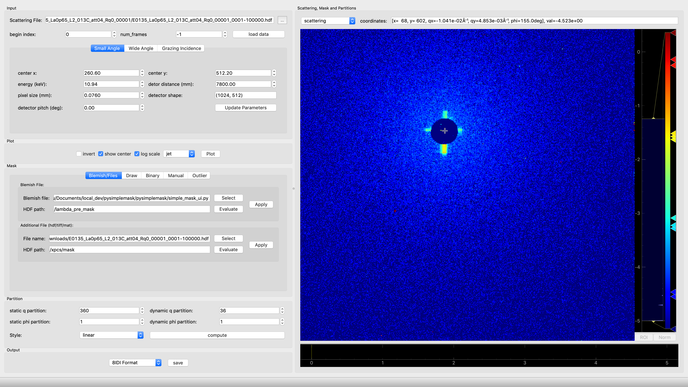
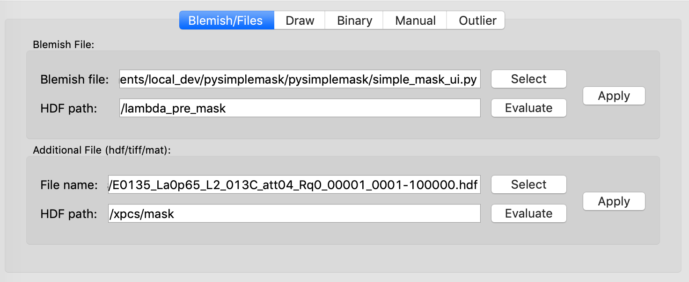
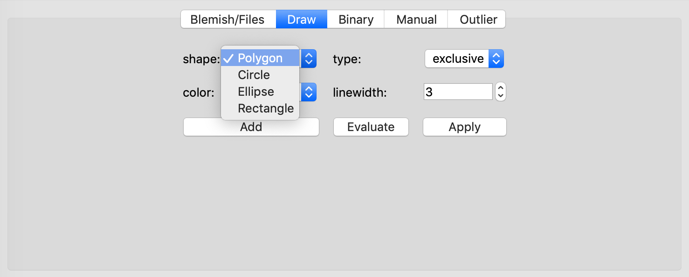
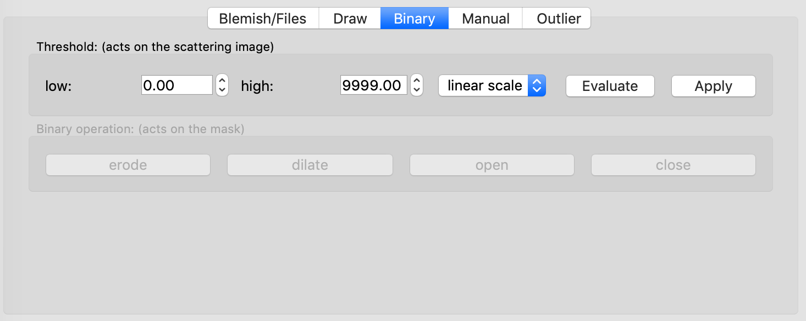
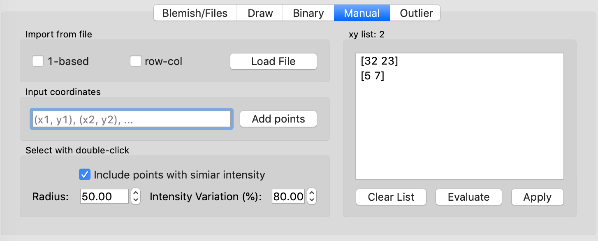
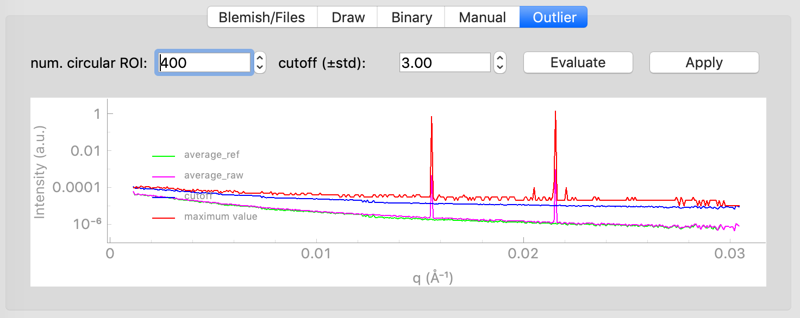
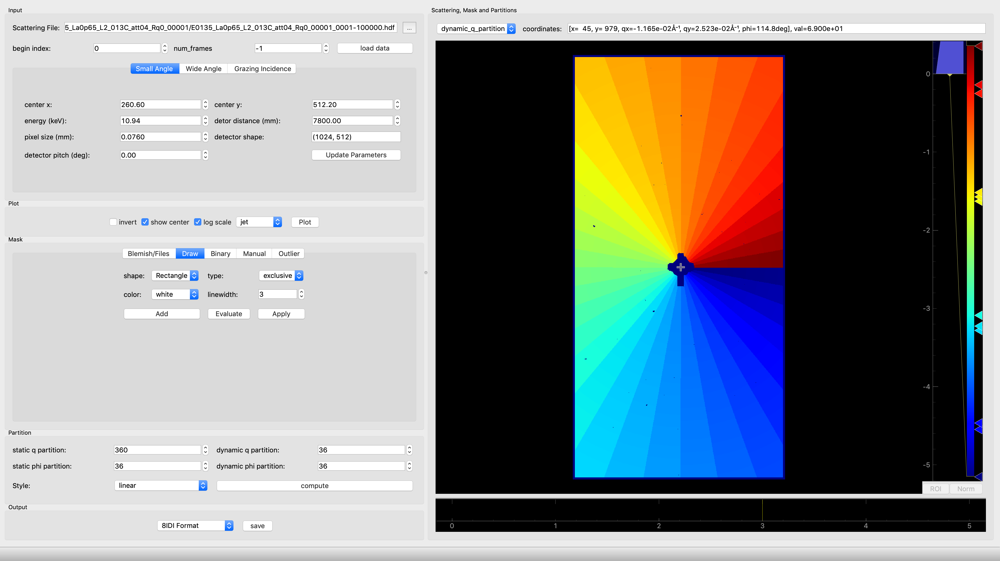

============
pySimpleMask
============

.. image:: https://img.shields.io/pypi/v/pysimplemask.svg
        :target: https://pypi.python.org/pypi/pysimplemask

.. image:: https://img.shields.io/travis/AZjk/pysimplemask.svg
        :target: https://travis-ci.com/AZjk/pysimplemask

.. image:: https://readthedocs.org/projects/pysimplemask/badge/?version=latest
        :target: https://pysimplemask.readthedocs.io/en/latest/?version=latest
        :alt: Documentation Status

A GUI tool to create mask and qmap for xarea detectors used in xray experiments

* Free software: MIT license
* Documentation: https://pysimplemask.readthedocs.io.

Installation
--------
Step 1. create your virtual environement::

    conda create -n YOUR_ENV_NAME python==3.9.7
    
Step 2. activate your newly created environment::

    conda activate YOUR_ENV_NAME

Step 3. clone pysimple to your local disk::
    
    git clone https://github.com/AdvancedPhotonSource/pySimpleMask.git
    
Step 4. install it::
    
    cd pySimpleMask
    pip install .
    
You may also need to install magic-bin on windows systems,
    
    pip install python-magic-bin

Step 5. run simplemask, open a terminal and activate your virtual environment, ::
    
    pysimplemask
    pysimplemask --path YOUR_HDF_PATH

Features
--------
Main layout

Create a mask by importing a blemish file or masks from other files

Create a mask by drawing on the scattering pattern.

Set a threshold to make the scattering image binary.

Manually set the the coordinates of bad pixels on the area detector. This can be done in 3 ways now. 1. import from a file (either CSV or white space separated). 2. mannaul input the coordinates. 3. use the mouse the double clicke the bad pixels. Other pixels with similar counts can also be selected.

Some bad pixels can be hard to detect. By doing azimuthal grouping, we can compute the statistics of photon counts on the pixels that have similar momentum transfer. The pixels that deviate from the average more than the cutoff will be masked out.

Create a qmap partition for SAXS and XPCS analysis.

Credits
-------

This package was created with Cookiecutter_ and the `audreyr/cookiecutter-pypackage`_ project template.

.. _Cookiecutter: https://github.com/audreyr/cookiecutter
.. _`audreyr/cookiecutter-pypackage`: https://github.com/audreyr/cookiecutter-pypackage
